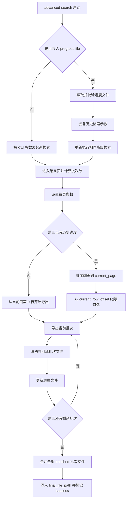

# CNKI 高级检索断点续跑设计文档
- **Status**: Approved
- **Date**: 2026-05-05

## 1. 目标与背景

当前 `advanced-search` 的批量导出流程在以下场景下无法恢复：

- 结果页翻页失败
- 勾选状态失效，导致“结果页未选中任何文献，无法导出”
- 浏览器、网络或验证码中断

现有实现中，批处理游标仅保存在进程内存：

- 已导出批次数
- 已导出总量
- 当前结果页页内偏移

一旦任务异常退出，用户只能从头重新检索并重新翻页，已经成功导出的批次也无法复用。

本次改动目标：

- 为 `advanced-search` 增加进度文件
- 首次运行时自动生成进度文件
- 失败或中断后，允许通过进度文件恢复同一检索任务
- 已成功生成的批次文件可直接复用，不重复导出
- 为失败现场增加结构化留痕，便于排查

## 2. 详细设计

### 2.1 模块结构

- `cnki-search/scripts/cli.py`: 增加 `--progress-file` 参数，并支持仅通过进度文件恢复任务
- `cnki-search/scripts/progress_store.py`: 负责进度文件读写、参数校验、默认路径生成
- `cnki-search/scripts/interactor.py`: 接入断点保存、恢复跳转、失败留痕、结果合并恢复
- `cnki-search/scripts/utils.py`: 增加进度文件的人类可读输出
- `tests/test_cnki_interactor.py`: 增加恢复游标与恢复校验测试
- `tests/test_cnki_progress_store.py`: 增加进度文件读写与参数解析测试

### 2.2 CLI 设计

保留：

- `--query`
- `--date-from`
- `--date-to`
- `--core`
- `--include-no-fulltext`
- `--max-download`

新增：

- `--progress-file`
  - 首次运行时可显式指定进度文件位置
  - 恢复运行时可单独传入，不再强制要求 `--query`

规则：

1. 若仅传入 `--progress-file`，则从进度文件恢复完整检索参数
2. 若同时传入检索参数与 `--progress-file`，则必须与进度文件中的历史参数一致，否则报错
3. 若未传入 `--progress-file`，系统仍自动在输出目录下生成默认进度文件

### 2.3 进度文件结构

进度文件采用 JSON，包含以下核心字段：

```json
{
  "version": 1,
  "status": "running",
  "search_params": {
    "query": "新青年",
    "date_from": null,
    "date_to": "2025",
    "core_only": false,
    "include_no_fulltext": true,
    "max_download": null
  },
  "runtime": {
    "output_dir": "E:/Desk/xinqingnian/outputs/cnki-search/新青年",
    "planned_download": 5600,
    "batch_count": 12,
    "exported_total": 5000,
    "exported_batches": 10,
    "next_batch_index": 11,
    "current_page": 101,
    "current_row_offset": 0,
    "enriched_batch_files": [
      "..."
    ],
    "final_file_path": "",
    "last_known_url": "https://kns.cnki.net/..."
  },
  "last_error": {
    "type": "ValidationError",
    "message": "结果页未选中任何文献，无法导出"
  },
  "updated_at": "2026-05-05T23:12:13+08:00"
}
```

设计原则：

- 检索参数与运行状态分离
- 只记录恢复所需最小状态，不持久化页面 DOM 细节
- 所有文件路径使用绝对路径，避免切换工作目录后恢复失败

### 2.4 恢复流程

恢复不依赖浏览器现场，而是重新执行同一检索后恢复游标：

1. 读取进度文件
2. 恢复并校验检索参数
3. 重新打开高级检索页并提交相同检索条件
4. 重新设置每页条数
5. 顺序翻页到 `current_page`
6. 从 `current_row_offset` 开始继续勾选并导出
7. 完成后与已存在批次文件统一合并

此方案的优点：

- 不依赖浏览器未持久化的临时状态
- 对登录态、验证码、页面刷新更鲁棒
- 修改范围小，能复用现有检索与导出逻辑

### 2.5 运行态保存策略

关键保存点：

1. 检索成功进入结果页后
   - 保存总数、计划导出数、总批次、输出目录、进度文件路径
2. 每个批次导出成功后
   - 保存已导出总量、已完成批次、下一批索引、当前页码、页内偏移、已生成批次文件
3. 任务成功结束时
   - 保存最终汇总文件路径，并将 `status` 置为 `success`
4. 发生异常或用户中断时
   - 保存失败状态、异常类型、异常消息、最后页码、最后 URL

### 2.6 批次文件复用策略

恢复时直接复用已完成批次的 `enriched` 文件：

- 不重新下载已成功批次
- 最终汇总阶段直接合并历史批次文件与新批次文件
- 若进度文件声明的历史批次文件缺失，则立即报错并终止恢复

这样可以避免 silent data loss，也能保持结果总量可审计。

### 2.7 可视化图表



## 3. 测试策略

- 进度文件
  - 首次运行时自动生成默认进度文件
  - 指定 `--progress-file` 时写入指定位置
  - 缺失 `query` 且无进度文件时应报参数错误
  - CLI 参数与进度文件参数冲突时应报错
- 恢复流程
  - 能根据进度文件恢复检索参数
  - 能跳转到目标页并从目标偏移继续
  - 已完成批次文件可复用并参与最终汇总
  - 历史批次文件缺失时应中止恢复
- 异常留痕
  - 勾选失败时记录异常类型、消息、最后页码、最后 URL
  - 用户中断时记录 `interrupted` 状态
- 回归验证
  - 首次完整导出路径不回归
  - 结果页翻页逻辑不回归
  - 清洗、回填、合并逻辑不回归

## 4. 风险与边界

- CNKI 结果排序、筛选条件或每页条数若被站点侧动态改变，恢复位置可能失真，因此恢复前必须重新执行完全相同的检索参数
- 本次恢复能力默认基于顺序翻页，不额外引入页面跳转输入框依赖
- 本次不处理“站点结果集发生变化导致文献位移”的语义一致性问题，恢复粒度以页码和页内偏移为准
