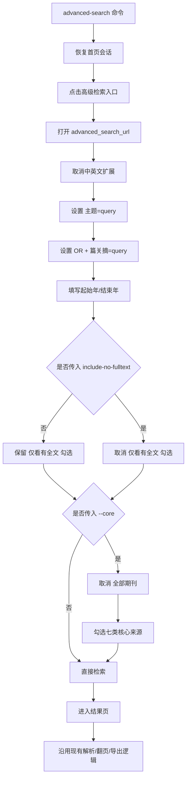

# CNKI 高级检索统一新页设计文档
- **Status**: Proposal
- **Date**: 2026-05-05

## 1. 目标与背景

当前高级检索存在两套页面行为假设，导致：

- `--core` 与非 `--core` 的入口策略不一致
- 日期控件选择器依赖旧页面结构
- “仅看有全文”无法由 CLI 显式控制

本次方案统一高级检索流程：

- 所有 `advanced-search` 都使用新地址 `https://kns.cnki.net/kns8s/AdvSearch?classid=YSTT4HG0`
- 仍然先打开首页并点击“高级检索”，再切换到新地址
- `date-from` / `date-to` 参数只接受年份
- 新增一个 CLI 参数，用于决定是否取消勾选 `仅看有全文`

其中，高级检索页面上的基础行为保持不变：

- 两个检索词
- 第 1 条字段为“主题”
- 第 2 条字段为“篇关摘”
- 逻辑为 `OR`
- 取消“中英文扩展”

## 2. 详细设计

### 2.1 模块结构

- `cnki-search/scripts/cli.py`: 收紧日期参数格式；新增“取消仅看有全文”的布尔开关
- `cnki-search/scripts/config.py`: 继续复用 `advanced_search_url`
- `cnki-search/scripts/interactor.py`: 统一高级检索页打开流程与表单填写逻辑
- `tests/`: 增加统一新页的参数校验与页面勾选测试

### 2.2 统一入口策略

高级检索入口统一为：

1. 恢复首页会话
2. 点击首页“高级检索”
3. 等待高级检索上下文初始化
4. 主动打开 `advanced_search_url`
5. 在新页面完成表单填写和提交

这样处理的原因：

- 保留现有首页登录态、验证码、站点初始化流程
- 避免直接访问新页时出现未初始化状态
- 后续所有高级检索都落在同一 DOM 结构上，降低分支复杂度

### 2.3 CLI 设计

保留：

- `--query`
- `--core`
- `--max-download`

调整：

- `--date-from`
  - 仅接受 `YYYY`
- `--date-to`
  - 仅接受 `YYYY`

新增：

- 推荐参数名：`--include-no-fulltext`
  - 默认不传：保留页面默认勾选 `仅看有全文`
  - 传入后：取消勾选 `仅看有全文`

推荐这个命名的原因是语义直接，且不会和页面上的“仅看有全文”形成双重否定。

### 2.4 页面交互规则

所有 `advanced-search` 在新页面下统一执行以下步骤：

1. 取消 `中英文扩展`
2. 保证存在两条检索条件
3. 第 1 条设置为：
   - 字段：`主题`
   - 检索词：`query`
4. 第 2 条设置为：
   - 逻辑：`OR`
   - 字段：`篇关摘`
   - 检索词：`query`
5. 写入起始年与结束年
6. 根据 CLI 参数决定是否取消 `仅看有全文`
7. 若传入 `--core`：
   - 取消勾选 `全部期刊`
   - 勾选 `WJCI / SCI / EI / 北大核心 / CSSCI / CSCD / AMI`
8. 点击“检索”

### 2.5 关键选择器策略

- 检索条件容器：`#gradetxt`
- 中英文扩展：`input[data-id='EN'][name='onlyChecked']`
- 仅看有全文：`#onlyfulltext`
- 起始年：`input[placeholder='起始年']`，兜底 `input[placeholder*='起始']`
- 结束年：`input[placeholder='结束年']`，兜底 `input[placeholder*='结束']`
- 全部期刊：`input[name='all']`
- WJCI：`input[key='LYBSM'][value='P12']`
- SCI：`input[key='SI'][value='Y']`
- EI：`input[key='EI'][value='Y']`
- 北大核心：`input[key='HX'][value='Y']`
- CSSCI：`input[key='CSI'][value='Y']`
- CSCD：`input[key='CSD'][value='Y']`
- AMI：`input[key='AMI'][value='P13']`
- 提交按钮：`input.btn-search`，兜底 `.btn-search`

### 2.6 输入输出约束

输入约束：

- `query` 必填
- `date-from` / `date-to` 仅接受四位年份
- 若 `date-from > date-to`，直接报参数错误

输出约束：

- 返回结构保持不变
- `core_only=True` 仅影响来源类别勾选，不再影响入口 URL 选择

### 2.7 可视化图表

## 3. 测试策略

- 参数校验
  - `--date-from 2024 --date-to 2025` 合法
  - `--date-from 2024-01` 非法
  - `--date-to abcd` 非法
  - `date-from > date-to` 非法
- 页面交互
  - 高级检索统一经过首页入口后再切换到新页
  - `中英文扩展` 被取消
  - 两条检索条件与 `OR` 正确设置
  - 起止年份正确写入
  - 默认保留 `仅看有全文`
  - 传入 `--include-no-fulltext` 后取消 `仅看有全文`
- `--core` 场景
  - `全部期刊` 被取消
  - `WJCI / SCI / EI / HX / CSI / CSD / AMI` 全部勾选
- 回归验证
  - 检索成功进入结果页
  - 结果页解析不回归
  - 翻页逻辑不回归
  - 批量导出逻辑不回归

## 4. 风险与边界

- 本方案默认新高级检索页提交后的结果页结构未发生破坏性变化
- 若首页点击“高级检索”后已自动进入目标新页，则二次 `goto` 需要避免重复等待过长
- 本次只统一高级检索页，不改普通搜索页逻辑

## 5. 待确认项

- 我建议新增参数名使用 `--include-no-fulltext`
- 如果你更希望参数名更短，也可以改成 `--all-results`，语义是“不过滤无全文记录”

