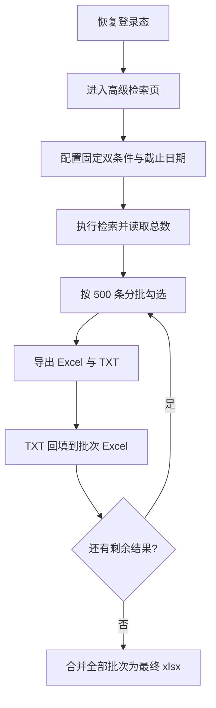

# CNKI 分批导出与最终合并设计文档
- **Status**: Proposal
- **Date**: 2026-05-04

## 1. 目标与背景
在现有 `cnki-search/scripts` 的高级检索导出能力上，新增固定双条件检索、500 条分批导出、GB/T 引文回填和最终总表合并能力，满足大结果集一次性完整落盘的需求。

## 2. 详细设计
### 2.1 模块结构
- `cnki-search/scripts/cli.py`: 扩展 `advanced-search` 参数，支持截止日期和总下载上限。
- `cnki-search/scripts/interactor.py`: 负责高级检索页配置、分批勾选、双格式导出、批次游标推进。
- `cnki-search/scripts/export_processor.py`: 负责 TXT 解析、Excel 回填、批次合并。
- `tests/test_cnki_export_processor.py`: 覆盖本地结果处理和参数校验。

### 2.2 核心逻辑/接口
- 检索条件固定为两条：
  - 第 1 条：`主题 = 检索词`
  - 第 2 条：`OR 篇关摘 = 检索词`
- 进入高级检索页后，取消 `中英文扩展`，设置截止日期 `--deadline-date`。
- `-n/--max-download` 表示总导出上限，按 `min(500, 剩余数量)` 分批。
- 每批导出两份文件：
  - 元数据 Excel
  - `GB/T 7714-2015` TXT
- 本地处理按顺序将 TXT 回填到 Excel 新列 `参考格式`，然后将所有增强后的批次文件合并为单个 `xlsx`。

### 2.3 可视化图表

## 3. 测试策略
- 单批导出结果的 TXT 解析与参考格式回填。
- 多批增强后文件的顺序合并。
- 截止日期参数格式校验。
- 浏览器交互通过静态校验和现有运行链路验证，验证码继续采用人工处理模式。
