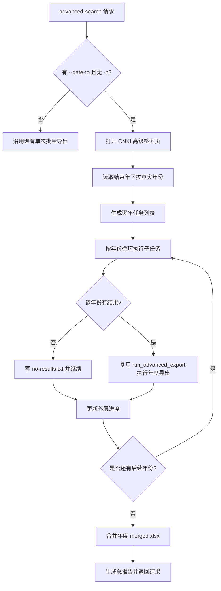

# CNKI 截至年份逐年导出设计文档
- **Status**: Implemented
- **Date**: 2026-05-08

## 1. 目标与背景
`CNKI advanced-search` 在“指定 `--date-to` 且未指定 `-n/--max-download`”的全量导出场景下，原逻辑会直接对单次检索结果做 500 条分批导出。

本次调整为逐年编排：

- 只有 `--date-to` 时，按真实可选年份逐年执行单年导出
- 同时有 `--date-from --date-to` 时，也按真实可选年份逐年执行单年导出
- 年度子任务内部仍复用既有 `CNKI` 单次批量导出骨架、分批导出、断点续跑与结果合并能力

## 2. 详细设计

### 2.1 模块结构
- `cnki-search/scripts/cnki_search_interactor.py`: 高级检索入口分流，接入逐年模式
- `cnki-search/scripts/cnki_yearly_export_ops.py`: 逐年外层编排、年度任务生成、总进度与总报告
- `cnki-search/scripts/cnki_yearly_progress_store.py`: 逐年外层进度文件存储
- `src/core/advanced_export_types.py`: 补充逐年模式非破坏性返回字段
- `tests/test_cnki_interactor.py`: 覆盖分流、年份任务生成、空年份继续与外层续跑
- `tests/test_cnki_progress_store.py`: 覆盖逐年外层进度文件路径与参数恢复

### 2.2 核心逻辑
- 分流条件：
  - `date_to` 有值
  - `max_download` 为空
- 年份来源：
  - 进入 CNKI 高级检索页
  - 从结束年下拉真实 DOM 提取可选年份
  - 去重、升序、过滤到 `[max(date_from, 1949), date_to]`
- 年度任务生成：
  - 仅 `date_to`：`year ~ year`
  - 同时有 `date_from/date_to`：`year ~ year`
  - `effective_start = max(date_from, 1949)`
- 年度执行：
  - 每个年份单独输出到 `output_dir/year-YYYY/`
  - 每个年份使用独立子进度文件
  - 子任务内部继续复用现有 `run_advanced_export()`
- 空年份处理：
  - 子任务返回 `no_results` 时不走下载
  - 写 `YYYY-no-results.txt`
  - 外层继续后续年份
- 总结果聚合：
  - 汇总全部成功年份的 merged xlsx
  - 生成外层总报告
  - 返回 `advanced_export`，并补充 `yearly_mode / executed_years / empty_years`

### 2.3 实际重构摘要
- 入口分流保持最小侵入：
  - 只在 `CNKI advanced-search` 且满足“有 `--date-to`、无 `-n/--max-download`”时切到逐年模式
  - 其他场景继续复用原有单次批量导出逻辑，不改 `vp`、`wanfang`、普通检索和限定数量下载路径
- 逐年模式采用“两层编排”：
  - 外层负责年份任务、外层总进度、空年份继续、年度结果汇总、总报告
  - 内层继续复用现有 `run_advanced_export()`，负责单个年份内部的 500 条分批、页码推进、批次进度、断点续跑和年度合并
- 共享骨架做了最小能力补充：
  - 为 `src/core/advanced_export_flow.py` 增加 `reuse_current_search_page`
  - 逐年模式下的年度子任务可直接复用当前高级检索页，而不是每年都重新打开高级检索页
- 进度模型升级为双层：
  - 外层总进度文件记录逐年编排状态
  - 年度子进度文件继续沿用原单次批量导出进度结构
  - 这样既能从“某一年”恢复，也能从“该年某一批次的某一页”恢复

### 2.4 外层与内层进度职责
- 外层逐年总进度记录：
  - `available_years`
  - `next_year_index`
  - `executed_years`
  - `empty_years`
  - `yearly_result_files`
  - `current_year`
  - `current_year_date_from`
  - `current_year_date_to`
  - `current_year_progress_file`
- 内层年度子进度继续记录：
  - `next_batch_index`
  - `current_page`
  - `current_row_offset`
  - `page_text`
  - 已完成批次文件列表
- 恢复语义：
  - 如果中断发生在某一年开始前，按 `next_year_index` 从下一未完成年份继续
  - 如果中断发生在某一年执行中，先用外层 `current_year*` 定位到该年，再用内层子进度继续该年的批次和页码
### 2.5 可视化图表

## 3. 联调暴露的 Bug 与修复

### 3.1 Bug 1：年度子任务重新打开高级检索页，导致页面上下文不稳定
- 现象：
  - 逐年模式进入第二个年份时，会再次从首页点击“高级检索”
  - 实际执行过程中新旧页面上下文混杂，容易出现原页面被关闭或页签状态不一致
  - 触发过 `Target page, context or browser has been closed`
- 根因：
  - 外层逐年编排虽然是一个连续流程，但年度子任务内部仍沿用“重新打开高级检索页”的默认行为
  - 共享导出骨架原先没有“复用当前检索页”的能力
- 修复：
  - 给共享骨架补充 `reuse_current_search_page`
  - 逐年模式开始前只确保一次高级检索页已就绪
  - 后续每个年份子任务都在当前页直接改查询条件并提交，不再重复开页
- 迁移建议：
  - `vp`、`wanfang` 如果也要做逐年编排，应优先复用当前检索页
  - 不要在外层循环中频繁重新打开高级检索页，尤其不要同时持有多个相似检索页上下文

### 3.2 Bug 2：把逐年下载误实现成累计区间，导致结果重复
- 现象：
  - 命令只有 `--date-to` 时，后续年份如果只改结束年，结果会不断叠加前面年份数据
  - 例如先跑 `1949`，再跑 `1955`，第二轮结果会包含 `1949-1955`，最终导致跨年份重复导出
- 根因：
  - 早期设计把“逐年下载”误理解成“固定起点、结束年递增”
  - 这种累计区间模型不适用于最终结果汇总，因为相邻年度任务天然存在重叠
- 修复后的正确规则：
  - 无论是否传入初始 `--date-from`，每轮都必须是“单年窗口”
  - 仅 `--date-to 1980`：
    - `1949 ~ 1949`
    - `1978 ~ 1978`
    - `1979 ~ 1979`
    - `1980 ~ 1980`
  - `--date-from 2002 --date-to 2005`：
    - `2002 ~ 2002`
    - `2003 ~ 2003`
    - `2004 ~ 2004`
    - `2005 ~ 2005`
- 迁移建议：
  - `vp`、`wanfang` 不要使用任何累计区间模型
  - 初始 `date_from` 只用于决定“从哪一年开始遍历”，不用于构造跨年检索窗口

### 3.3 Bug 3：复用当前页时，未主动清空年份输入框，旧值残留
- 现象：
  - 第一轮处理 `1949 ~ 1949` 后，第二轮切到 `1978 ~ 1978` 时，如果不完整覆盖表单，页面仍可能残留上一轮年份值
- 根因：
  - 表单填写逻辑只在参数非空时写入输入框
  - 逐年模式复用同一高级检索页时，如果不把本轮起止年完整写回，就会保留上一轮值
- 修复：
  - 表单填写时无论是否有值，都显式写入年份输入框
  - 逐年模式下每一轮都强制写入 `date_from=year`、`date_to=year`
  - 不允许依赖页面自然重置或只改单个年份字段
- 迁移建议：
  - 只要复用同一检索页，所有可变表单项都必须“全量重写”，不能依赖页面自然重置
  - 对于下拉、输入框、复选框都应按“本轮完整状态”覆盖

### 3.4 可复用经验
- 逐年编排是外层调度问题，不要重写内层成熟的批量导出能力
- 外层循环一旦复用页面，就必须保证每轮检索条件显式覆盖，不允许依赖上一轮页面状态
- 断点续跑至少要覆盖两层：
  - 年份层：当前处理到哪一年
  - 年内层：当前批次、页码、行偏移
- 年份来源必须取真实页面 DOM，不要自己硬编码年份序列

## 4. 测试策略
- 分流：
  - `--date-to` 且无 `-n` 时进入逐年模式
  - 有 `-n` 时保持旧逻辑
- 年份任务：
  - 仅基于真实可选年份生成任务
  - 无论是否传入 `date_from`，每轮都生成 `year ~ year`
  - `date_from` 仅决定起始遍历年份下界
  - `date_from < 1949` 时钳制为 `1949`
- 空年份：
  - `no_results` 写年度说明文件并继续
- 续跑：
  - 外层进度恢复时从下一个未完成年份继续
  - 不重复读取已写入进度的年份列表
  - 外层进度显式记录当前处理年份与区间
  - 内层子进度继续记录当前批次、页码与行偏移
- 页面复用：
  - 年度子任务复用当前高级检索页，不再重复打开高级检索页
  - 复用页面时应主动清空空值字段，避免沿用上一轮输入
