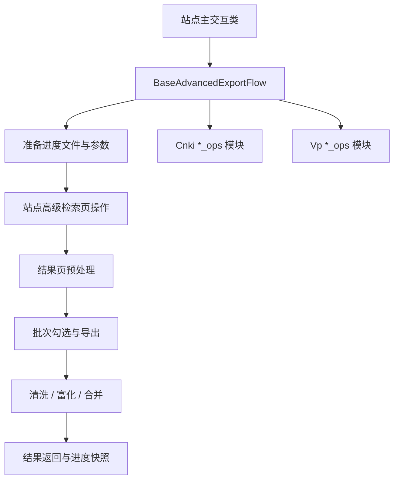

# 高级检索交互器共享骨架重构设计
- **Status**: Proposal
- **Date**: 2026-05-06

## 1. 目标与背景
将 `cnki-search/scripts/interactor.py` 与 `vp-search/scripts/interactor.py` 中重复的高级检索批量导出主流程抽离为共享骨架，同时把两个超大文件按职责拆分为多个站点模块，降低重复代码和后续维护成本。

## 2. 详细设计
### 2.1 模块结构
- `src/core/advanced_export_flow.py`: 高级检索批量导出共享主流程骨架。
- `src/core/advanced_export_types.py`: 共享运行态、批次结果、导出结果类型。
- `src/utils/playwright_page.py`: 页面原子操作工具。
- `src/utils/result_output.py`: 扩展共享文件名与导出路径构造函数。
- `cnki-search/scripts/cnki_search_interactor.py`: CNKI 主交互实现。
- `cnki-search/scripts/cnki_*_ops.py`: CNKI 按职责拆分的公共检索、进度、表单、导航、勾选、导出模块。
- `vp-search/scripts/vp_search_interactor.py`: 维普主交互实现。
- `vp-search/scripts/vp_*_ops.py`: 维普按职责拆分的进度、表单、分页大小、复选框、导航、导出模块。
- `tests/test_advanced_export_flow.py`: 共享骨架单测。

### 2.2 核心逻辑/接口
- 对外接口保持不变：
  - `CnkiSearchInteractor.advanced_search(...)`
  - `VpSearchInteractor.advanced_search(...)`
- 删除无实际职责的 `interactor.py` 门面文件，CLI 直接引用新的主交互实现模块。
- 共享骨架固定处理：
  - 进度文件初始化与参数恢复。
  - 打开高级检索页、提交检索、解析总数。
  - 批次循环、导出文件后处理、进度快照、最终合并。
- 站点实现负责：
  - 高级检索页元素与表单填写。
  - 结果页分页策略与批量勾选。
  - 导出入口、导出页面和下载校验。

### 2.3 可视化图表

## 3. 测试策略
- 共享骨架覆盖：
  - 无结果返回。
  - 成功批次推进与合并。
  - 导出异常后的失败快照。
- 站点交互覆盖：
  - CNKI 与维普原有交互单测继续通过。
  - 测试加载器避免同名脚本模块互相污染。
