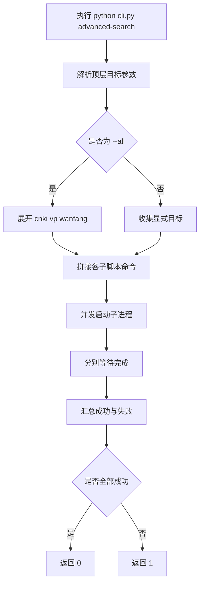

# 顶层高级检索 CLI 设计文档
- **Status**: Proposal
- **Date**: 2026-05-07

## 1. 目标与背景
新增仓库根目录 `cli.py`，为 `cnki`、`vp`、`wanfang` 三个高级检索脚本提供统一命令入口。

本次设计只覆盖 `advanced-search`，不改动三个子模块的具体检索逻辑，只负责目标选择、参数透传、并发调度与退出码汇总。

## 2. 详细设计

### 2.1 模块结构
- `cli.py`: 顶层统一入口，负责参数解析与异步调度
- `tests/test_root_cli.py`: 验证顶层 CLI 的参数解析、失败隔离与退出码

### 2.2 核心逻辑
- 支持 `advanced-search --all`
- 支持 `advanced-search --cnki --vp --wanfang` 的任意组合
- `--all` 与显式目标参数互斥
- 未指定任何目标时直接报参数错误
- 顶层只透传剩余参数给各子脚本，不感知具体检索参数含义

### 2.3 调度方式
- 使用 `asyncio.create_subprocess_exec` 并发启动子脚本
- 每个目标独立运行，不共享进程内模块状态
- 单个目标失败时，不取消其他目标任务

### 2.4 退出码策略
- 全部成功返回 `0`
- 只要存在失败目标返回 `1`

### 2.5 可视化图表

## 3. 测试策略
- 验证 `--all` 能正确展开三个目标
- 验证透传参数不会被顶层 CLI 吃掉
- 验证 `--all` 与显式目标混用时报错
- 验证某一路启动失败时，其他目标仍继续执行
- 验证全部成功返回 `0`
- 验证未指定目标返回参数错误
