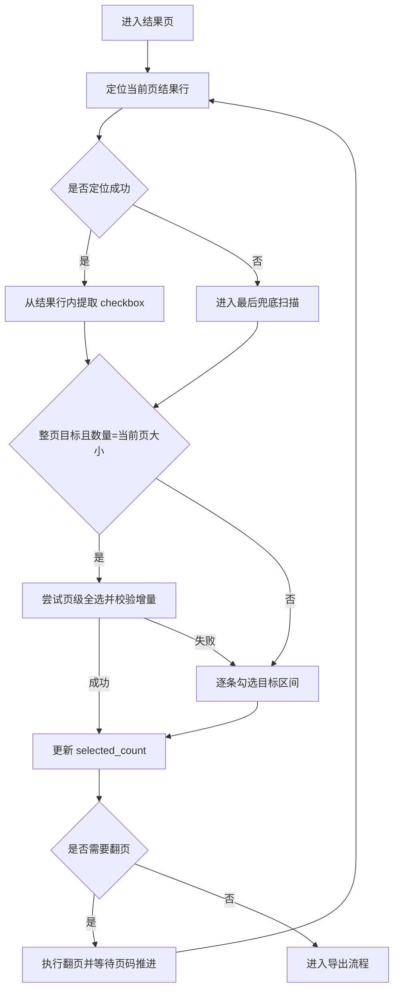

# VP 批量勾选性能优化设计文档
- **Status**: Proposal
- **Date**: 2026-05-07

## 1. 目标与背景

当前 `vp-search` 在高级检索批量导出时，导出 `623` 条数据耗时约 `20` 分钟，明显超出可接受范围。

结合本次运行日志与现有实现，热点不在导出文件下载，而在结果页批量勾选阶段，尤其是第 `8` 页之后的“当前页复选框采集”链路：

- 第 `1` 至 `7` 页整体正常。
- 第 `7` 页出现一次页级全选误判：预期新增 `3` 条，实际新增 `50` 条。
- 第 `8`、`9`、`10`、`11`、`12`、`13` 页均出现“按页码切分复选框失败 -> 回退可见性筛选”。
- 单页复选框采集耗时约 `116s ~ 133s`，远高于翻页和下载耗时。

本次目标：

- 明确慢路径与冗余逻辑的根因。
- 给出最小改动方案与重构方案。
- 在不破坏 `src/core/advanced_export_flow.py` 共享骨架的前提下，将 `vp-search` 收敛到与 `cnki-search` 同一类“按当前页结果行驱动”的模型。

## 2. 详细设计

### 2.1 模块结构

- `vp-search/scripts/vp_checkbox_list_ops.py`: 当前页结果项发现逻辑，需从“全局 checkbox 切片”切换为“当前页结果行定位”。
- `vp-search/scripts/vp_selection_ops.py`: 当前页勾选策略，保留整页全选与逐条勾选分流，但输入改为稳定的当前页结果集。
- `vp-search/scripts/vp_navigation_ops.py`: 翻页逻辑保留，仅做少量接口适配。
- `vp-search/scripts/vp_search_interactor.py`: 增加维普结果行选择器常量。
- `tests/test_vp_interactor.py`: 增加页级定位、误判回退、深页采集性能相关回归测试。

### 2.2 根因分析

#### A. 当前页识别模型不成立

`vp-search/scripts/vp_checkbox_list_ops.py` 当前核心路径：

1. 通过 `input[name='selectArticle']` 等全局选择器拿到整页所有 checkbox。
2. 按 `current_page * page_size` 计算切片区间。
3. 若切片失败，再对整个候选集逐个做可见性探测。

问题在于维普结果页的 DOM 不满足“checkbox 节点按页码线性排列且总量持续增长”的假设。

从日志看：

- 第 `7` 页时 `total_count=304`，过滤后 `filtered_count=3`。
- 第 `8` 页后 `total_count` 仍停留在 `304`，而不是继续增长到 `400+`。
- 说明全局 locator 抓到的是一组复用/残留节点，而不是“当前页之前所有记录的线性累积”。

这会直接导致：

- `vp_checkbox_list_ops.py` 中的 `_slice_checkbox_items_by_current_page()` 在深页必然越界或切到错误尾部样本。
- `_collect_visible_result_row_checkboxes()` 被迫退化为对 `300+` 节点逐个做 `is_visible()` 与祖先查找。
- `_select_rows_on_current_page()` 拿到不完整样本后，仍可能触发整页全选，放大误选风险。

#### B. 慢路径存在明显的 O(全量节点) 浏览器往返

`vp-search/scripts/vp_checkbox_list_ops.py` 的回退逻辑存在多层高成本操作：

- 对每个候选 checkbox 读取 `name` / `data-name`
- 对每个候选求点击目标 `_resolve_checkbox_click_target()`
- 对点击目标再调用 `count()` / `is_visible()`

这类操作都发生在 Playwright Python 侧与浏览器侧之间，单页 `300+` 个节点时延会被放大到分钟级。

#### C. 站点模型与 `cnki-search` 已出现分叉

`cnki-search/scripts/cnki_selection_ops.py` 的模型是：

- 先定位当前页结果行 `tbody tr`
- 再在当前页结果行内找 checkbox
- 页内勾选完成后，只对当前页目标区间做补勾校验

这是一种“当前页结果行驱动”的稳定模型，不依赖全局节点累积。`vp-search` 目前的核心问题不是“缺少更多等待”，而是“基础数据模型选错了”。

### 2.3 优化方案

#### 方案 A：最小改动修复，保留现有骨架与大部分勾选逻辑

核心思路：

- 废弃“全局 checkbox + 页码切片”作为主路径。
- 新增“当前页结果行 -> 行内 checkbox”作为主路径。
- 仅保留现有全选、逐条勾选、翻页、导出、进度存储逻辑。

设计要点：

- 在 `VpSearchInteractor` 中增加结果行选择器常量，例如：
  - `.search-list > *`
  - `.result-list > *`
  - `.article-item`
  - 其他经页面验证后确定的当前页结果容器
- 在 `vp_checkbox_list_ops.py` 新增两个阶段：
  - `_current_result_rows()`: 返回当前页可见结果行
  - `_checkboxes_from_result_rows(rows)`: 从每个结果行中提取 checkbox
- `_current_page_checkbox_items()` 直接返回“当前页结果行对应的 checkbox 列表”，不再依赖 `current_page * page_size` 切片。
- `_collect_visible_result_row_checkboxes()` 降级为仅在结果行定位失败时使用的最后兜底。

收益：

- 单页采集复杂度从 “扫描 300+ 全局节点” 降到 “扫描当前 50 行”。
- 第 `8` 页之后不会再因全局总数冻结而退化。
- 改动集中在 `vp_checkbox_list_ops.py`，风险相对可控。

风险：

- 需要先确认维普当前结果页的稳定行容器选择器。
- 如果结果行结构在不同检索模式下有差异，需要做 2 到 3 个候选选择器兼容。

#### 方案 B：按 `cnki-search` 彻底重构结果页勾选模型

核心思路：

- 将 `vp-search` 的“当前页采集 + 页内勾选”整体改写为与 `cnki-search` 同类的行级驱动模型。
- 删除现有的页码切片假设、全局 checkbox 扫描兜底、部分不必要的回滚辅助逻辑。

设计要点：

- `vp_selection_ops.py` 以“当前页结果行数”为第一输入，而不是“当前页 checkbox 列表长度”。
- 当前页整页全选时：
  - 先点击页级全选。
  - 再校验选中总数增量。
  - 失败则只对当前页结果行逐条补勾。
- 部分页目标时：
  - 只遍历当前页目标区间的结果行。
  - 不再依赖全局索引和全局 locator。
- 删除或降级以下逻辑：
  - `_slice_checkbox_items_by_current_page()`
  - `_is_reliable_page_slice()`
  - `_collect_visible_result_row_checkboxes()` 的主路径职责
  - 与“全局节点累积”绑定的补偿判断

收益：

- 结构更接近 `cnki-search`，后续维护成本更低。
- 站点差异收敛到选择器与 checkbox 点击方式，业务流程保持一致。
- 能从根上去掉当前最脆弱的一层抽象。

风险：

- 这已经属于明确的站点侧重构，不是小修。
- 需要补齐更多测试，避免回归到历史上的“误全选 / 假翻页 / 部分页误判”问题。

### 2.4 推荐方案

推荐分两阶段执行：

1. 先落地方案 A，快速消除第 `8` 页后的分钟级慢路径。
2. 若验证稳定，再继续推进方案 B，把 `vp-search` 收敛到与 `cnki-search` 一致的行级模型。

原因：

- 当前最大问题是错误的主路径假设，不是缺少更多微调。
- 方案 A 能用最小修改验证“当前页结果行驱动”是否可行。
- 一旦验证通过，方案 B 的重构就会更稳，不需要盲目一次性推翻。

### 2.5 可视化图表

## 3. 测试策略

- `tests/test_vp_interactor.py`
  - 验证深页场景下不再调用“按页码切片失败 -> 全量可见性扫描”主路径。
  - 验证当前页结果行为 `50` 时，采集结果稳定为 `50` 个 checkbox。
  - 验证当前页结果行为 `3` 时，不允许误触发整页 `50` 条全选。
  - 验证部分页目标下只遍历当前页目标区间。
- 性能回归
  - 使用模拟 locator 统计采集函数调用次数，确保深页不再出现 O(300+) 可见性探测。
- 真实链路回归
  - `python vp-search/scripts/cli.py advanced-search --query "新青年" --date-to 2025 -n 623 --debug`
  - 重点关注第 `8` 页之后的 `当前页复选框采集完成 elapsed_ms` 是否从 `100000ms+` 降到秒级。

