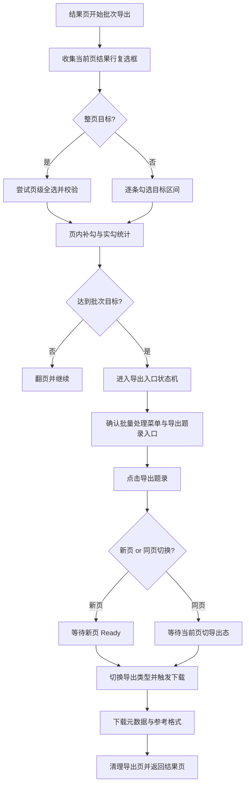

# VP 勾选与导出链路重构设计文档
- **Status**: Proposal
- **Date**: 2026-05-07

## 1. 目标与背景
`vp-search` 当前在高级检索严格数量导出场景中，已经暴露出两类问题：

1. 结果页勾选链路过重，速度明显慢于 `cnki` 与 `wanfang`
2. 导出入口识别不稳定，存在 `等待导出页面打开超时` 的失败路径

从当前代码与复盘信息看，`vp` 的问题不是单点 bug，而是整体流程设计偏重：

- 勾选阶段依赖较多全局已选数量读取
- 翻页后复选框采集链路较长
- 导出页打开逻辑同时兼容“当前页切换”“新页打开”“菜单延迟出现”“导出类型自动下载/确认下载”等多种行为，但状态判定仍不够收敛

本次目标是参考 `cnki`、`wanfang` 已验证的轻量路径，对 `vp` 的高级检索导出链路做一次结构化重构，优先保证：

- **准确性**：严格数量模式下不超选、不漏选
- **效率**：减少不必要的 DOM 轮询与全局计数依赖
- **稳定性**：导出入口、导出页、导出类型切换判定统一收敛

## 2. 详细设计

### 2.1 模块结构
- `vp-search/scripts/vp_selection_ops.py`: 保留批次勾选主流程，但改为页内实勾数量驱动
- `vp-search/scripts/vp_checkbox_list_ops.py`: 保留当前页候选采集能力，只负责“当前页可操作结果行集合”
- `vp-search/scripts/vp_navigation_ops.py`: 只负责结果页跳转与页码推进确认
- `vp-search/scripts/vp_export_ops.py`: 重构为导出入口状态机，统一处理菜单展开、同页切换、新页打开、导出类型判定
- `tests/test_vp_interactor.py`: 增补勾选、翻页、导出入口多路径回归测试

如重构后单文件复杂度仍偏高，允许在 `vp-search/scripts/` 下拆出：
- `vp_export_page_ops.py`: 导出页打开与识别
- `vp_export_download_ops.py`: 导出类型切换与下载触发

### 2.2 核心重构原则

#### A. 勾选链路向 `cnki/wanfang` 靠拢
- 当前页整页目标：优先尝试页级全选
- 当前页部分目标：只按目标区间逐条勾选
- 当前页勾选完成后，以“本页实际勾选数量”作为主累计值
- 全局已选数量读取只作为校验与兜底，不再作为每页推进的主依据

#### B. 当前页候选集合只做一件事
`vp_checkbox_list_ops` 只保证返回“当前页可操作结果行复选框列表”，不承担：
- 导出数量推进
- 全局选中数校验
- 翻页推进判断

#### C. 导出入口改为显式状态机
当前 `vp_export_ops` 主要依靠“点击导出入口后轮询页面是否像导出页”，状态不够明确。重构后统一拆成：

1. 入口可见态确认
2. 入口点击结果判定
3. 导出页面归属确认
4. 导出类型切换确认
5. 下载触发确认

### 2.3 勾选主流程重构

#### 当前问题
`vp_selection_ops.py` 当前每页会：
- 等待结果页
- 固定稳定等待
- 采集当前页复选框
- 通过 `_extract_selected_count()` 读取页前/页后全局已选数量
- 用全局数量反推剩余目标

这条链路相对 `cnki`/`wanfang` 更重。

#### 重构方案
改为“页内实勾数量优先”的流程：

- `page_target_count = min(当前页可选数, remaining)`
- `_select_rows_on_current_page(...) -> page_selected_count`
- `selected_count += page_selected_count`
- `remaining = export_limit - selected_count`

页内仍保留：
- 整页全选校验
- 部分页逐条勾选
- 勾选缺口补勾

但 `_extract_selected_count()` 的职责降级为：
- 页级全选后的异常校验
- 关键节点的保护性校验
- 调试日志辅助

这样可以减少大量“读全局已选数量 -> 再反推本页结果”的往返调用。

### 2.4 当前页复选框采集策略

保留当前分层策略，但进一步明确优先级：

1. **页码切片命中且可信**
   - 直接使用页码切片结果
   - 对切片仅做轻量结果行过滤
   - 若混入页级全选框，顺延补齐结果行

2. **页码切片不完整**
   - 回退到可见性扫描

3. **任何情况下都不允许把页级全选框返回给上层勾选逻辑**

### 2.5 翻页确认策略

沿用最近一次优化后的方向，但进一步收敛为：

- 单轮轮询只解析一次 `parse_results_summary()`
- 页码推进是主信号
- URL 变化与首条标题变化只作为辅助手段
- 翻页成功后，优先把已解析摘要透传给调用方，避免重复解析

### 2.6 导出入口与导出页重构

#### 当前问题
`vp` 当前 `_open_export_page()` 的失败根因在于：  
入口点击后，代码只在一个统一轮询中尝试识别“新打开页面”或“当前页变成导出页”，但没有显式区分以下几种站点行为：

- 需要先展开“批量处理”菜单
- 点击“导出题录”后复用当前页
- 点击“导出题录”后新开页
- 导出页存在短暂加载空白态
- 导出入口点击成功，但导出页 Ready 标记晚于页面打开

#### 重构方案
参考 `wanfang` 与 `cnki`，把导出链路拆成以下状态：

1. `MENU_READY`
   - 导出题录入口本身可见，或可通过展开批量处理菜单显现

2. `ENTRY_CLICKED`
   - 点击导出题录动作已发出

3. `PAGE_OPENED`
   - 出现新页面，或当前页 URL / 关键 DOM 发生导出页切换

4. `PAGE_READY`
   - 导出页关键元素可见，如：
     - 导出类型标签
     - 导出确认按钮
     - 导出选项容器

5. `TYPE_READY`
   - 目标导出类型已进入选中态

6. `DOWNLOAD_TRIGGERED`
   - 点击类型即下载，或点击确认按钮下载

#### 导出页识别建议
`vp` 不应仅依赖单个 selector 判断导出页，应定义一组 Ready 标记并允许分层判定：

- 一级标记：导出类型标签存在
- 二级标记：导出按钮存在
- 三级标记：当前页上下文中已不再是结果页主布局

#### 导出入口等待策略
- 优先 `expect_popup` 捕获新页
- 若未捕获，再轮询新页列表
- 若仍无新页，再检测当前页是否切为导出页
- 只在“页面已打开但 DOM 未完全 ready”时使用短轮询

这样可以把“页面未打开”和“页面已打开但未 ready”这两类超时拆开，错误信息更准确。

### 2.7 错误模型
建议把 `vp` 导出相关失败细化为：

- `未找到导出题录入口`
- `已点击导出题录，但未检测到导出页打开`
- `导出页已打开，但关键元素未就绪`
- `导出类型未切换成功`
- `导出下载未触发`

这样后续日志与复盘会比现在统一落成“等待导出页面打开超时”更有用。

### 2.8 可视化图表


## 3. 测试策略

### 3.1 勾选回归
- 严格数量 `175` 场景应得到 `50 + 50 + 50 + 25`
- 后续页候选集合混入页级全选框时，不得超选
- 部分页目标只逐条勾选目标区间
- 页级全选计数异常时回退逐条勾选

### 3.2 翻页回归
- 正常下一页推进
- 页码文本变化但 URL 不变时仍能判定成功
- 假翻页时应重试并最终报错

### 3.3 导出入口回归
- 导出入口直接可见
- 需要先展开批量处理菜单
- 点击后新开标签页
- 点击后复用当前页
- 页面已打开但导出页 DOM 延迟就绪
- 点击导出类型即自动下载
- 未自动下载时回退确认按钮

### 3.4 真实验证建议
至少验证以下命令：

```bash
python vp-search/scripts/cli.py advanced-search --query "新青年" --date-to 2025 -n 50
python vp-search/scripts/cli.py advanced-search --query "新青年" --date-to 2025 -n 175
python cli.py advanced-search --all --query "新青年" --date-to 2025 -n 175
```

重点关注：
- `选中` 是否等于 `计划导出`
- `vp` 是否仍明显慢于 `cnki/wanfang`
- 是否再出现 `等待导出页面打开超时`

## 4. 风险与边界
- 这是一次重构，不建议在原有函数中继续零散补丁式修复
- 若站点真实 DOM 与当前测试假设差异较大，需以实际页面结构优先
- 若你希望我在编码前进一步收敛导出页元素，我建议你补一份 `vp` 导出页的 HTML 片段或截图，这会显著降低重构后再返工的概率
