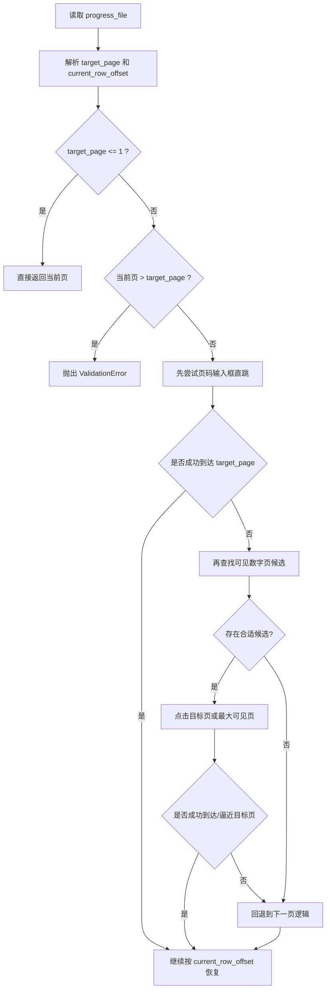

# 维普断点续跑页码直跳恢复设计文档
- **Status**: Proposal
- **Date**: 2026-05-06

## 1. 目标与背景
当前 `--progress-file` 的恢复逻辑会根据进度文件中的 `current_page` 顺序翻页恢复位置。当目标页较大时，恢复速度慢，且翻页过程容易受到分页按钮状态、页面刷新和验证码的影响。

目标是将恢复策略改为：

- 优先使用分页区的“到第 X 页”输入框直接跳转
- 若输入框跳转失败，再尝试当前分页条中可见的数字页按钮
- 如果两种跳页方式都失败，再回退到现有的“下一页”逻辑
- 保持现有 `current_row_offset` 恢复语义不变，只优化“到达目标页”的过程

## 2. 详细设计
### 2.1 模块结构
- `vp-search/scripts/interactor.py`: 增加结果页恢复跳页能力，保留“下一页”兜底
- `vp-search/scripts/result_parser.py`: 复用现有页码解析能力，作为跳转完成判定依据
- `tests/test_vp_interactor.py`: 增加页码输入跳转成功、可见数字页跳转成功、跳转失败回退、非法目标页等测试

### 2.2 核心逻辑/接口
现状：

- `_restore_results_position(target_page)` 仅调用 `_goto_next_results_page()` 循环前进

建议改造：

1. 新增 `_jump_to_results_page(target_page) -> bool`
   - 职责：通过分页区 `layui-laypage-skip` 输入框和“确定”按钮直接跳到目标页
   - 返回：
     - `True`: 已确认跳到目标页
     - `False`: 当前页不存在可用跳转控件，或点击后未跳到目标页
   - 行为：
     - 同时尝试 `#headerpager`、`#footerpager`
     - 找到 `input.layui-input` 后先清空再输入目标页
     - 点击 `.layui-laypage-btn`
     - 使用 `parse_results_summary()["current_page"]` 轮询确认是否到达目标页

2. 新增 `_find_resume_target_page_link(current_page, target_page) -> Optional[Locator]`
   - 职责：解析当前分页条中可见的数字页候选
   - 返回：
     - 目标页当前可见时，返回目标页按钮
     - 目标页不可见时，返回不超过目标页的最大可见页按钮
     - 没有合适候选时返回 `None`

3. 调整 `_restore_results_position(target_page)`
   - 先做边界校验：
     - `target_page <= 1` 直接返回
     - 当前页大于目标页时抛错
   - 恢复循环内按以下优先级尝试：
     - 先调用 `_jump_to_results_page(target_page)`
     - 若输入框直跳失败，再调用 `_find_resume_target_page_link(current_page, target_page)`
     - 若可见数字页也不可用，再降级到 `_goto_next_results_page()`

4. 保留恢复语义
   - `current_page` 仍表示“下次继续时应从该页开始处理”
   - `current_row_offset` 仍表示该页已处理到的行偏移
   - 也就是说，本次变更只优化“到页”方式，不改变进度文件结构

### 2.3 关键选择器
- 分页容器：
  - `#headerpager`
  - `#footerpager`
- 跳转输入框：
  - `.layui-laypage-skip input.layui-input`
- 跳转确认按钮：
  - `.layui-laypage-skip .layui-laypage-btn`

### 2.4 回退策略
- 直跳控件不存在：尝试可见数字页跳转
- 输入后页码未变化：尝试可见数字页跳转
- 没有合适的可见数字页：回退“下一页”逻辑
- 触发验证码或页面异常：沿用现有验证码处理与等待逻辑
- 目标页超出总页数：抛出 `ValidationError`

### 2.5 可视化图表

## 3. 测试策略
- 正常路径：
  - 存在 `footerpager` 跳转框时，输入目标页并成功到达
  - 存在 `headerpager` 跳转框时，输入目标页并成功到达
  - 输入框跳转失败后，能继续使用可见数字页跳到目标页或更接近目标页
- 边界条件：
  - `target_page = 1` 时不执行跳转
  - `target_page` 大于总页数时抛出异常
  - 当前页已大于目标页时抛出异常
- 异常路径：
  - 跳转控件缺失时自动尝试可见数字页
  - 点击“确定”后页码未变化时自动尝试可见数字页
  - 没有合适数字页候选时自动回退“下一页”逻辑
  - 直跳期间出现验证码时复用现有等待逻辑

## 4. 取舍说明
- 不建议完全删除“下一页”逻辑，因为输入框和数字页按钮都依赖分页控件状态，极端情况下仍需要稳定兜底
- 建议采用“输入框直跳优先 + 可见数字页补充 + 下一页兜底”的三段式方案，兼顾恢复速度与稳定性

## 5. 待确认事项
- 是否要在日志中增加 `target_page`、`restore_mode=skip_input|visible_link|next` 字段，便于后续排障
