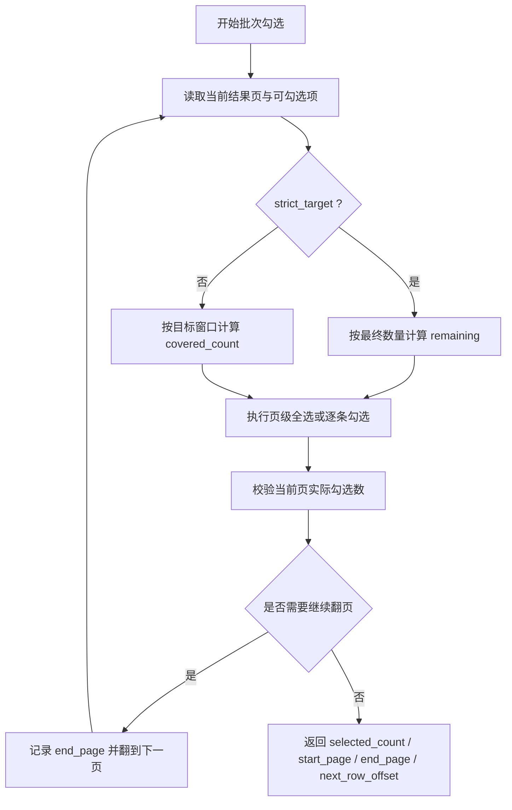

# VP 检索批量导出同步 CNKI 策略设计文档
- **Status**: Proposal
- **Date**: 2026-05-07

## 1. 目标与背景

当前 `src/core/advanced_export_flow.py` 已具备两项共享能力：

- 根据 `max_download` 是否为空，区分“全量导出模式”与“限定数量模式”。
- 为每个批次和整次任务生成文本报告，并在结果结构中回传报告路径。

`cnki-search` 已完成站点侧适配，但 `vp-search` 仍存在以下不一致：

- `_select_batch_results()` 虽接收 `strict_target`，但实际被忽略。
- 批次勾选结果未回传 `start_page` / `end_page`，导致批次报告缺少页码范围。
- CLI 的 `saved_files` 未透出 `batch_report_files` 与 `report_file`。

本次目标是让 `vp-search` 与 `cnki-search` 在高级检索批量导出能力上保持一致，同时坚持最小改动，不改共享骨架。

## 2. 详细设计

### 2.1 模块结构

- `vp-search/scripts/vp_selection_ops.py`: 同步维普站点勾选策略分流、页码范围记录与结果回传。
- `vp-search/scripts/cli.py`: 将报告文件路径写入 `saved_files`。
- `vp-search/scripts/utils.py`: 在人类可读输出中展示总报告路径。
- `tests/test_vp_interactor.py`: 补充维普两种勾选策略与页码范围断言。

### 2.2 核心逻辑/接口

#### A. 维普批次勾选策略分流

输入：

- `export_limit`: 当前批次目标数。
- `row_offset`: 当前页起始行偏移。
- `strict_target`: 是否必须补足最终目标数。

输出：

- `selected_count`: 实际勾选数。
- `next_row_offset`: 下一批继续的位置。
- `page_row_count`: 当前停留页的行数。
- `already_at_target`: 是否达到目标数。
- `start_page`: 本批首次触达页码。
- `end_page`: 本批最后触达页码。

规则：

- 当 `strict_target=True` 时，维持现有“继续翻页补足缺口”的行为。
- 当 `strict_target=False` 时，以“覆盖目标窗口”为准，不为了补足本页勾选缺口再额外跨页追数。
- 每进入一页都记录当前页码，最终写回 `start_page` / `end_page`。

#### B. 页内勾选后的实际数量校验

维普与 CNKI 的页面形态不同，但目标一致：

- 页级全选后，必须用已选数量或目标区间复选框状态校验实际增量。
- 若整页全选校验异常，回退到逐条勾选。
- 逐条勾选结束后，以“实际勾选结果”而不是“理论目标数”推进批次状态。

说明：

- 维普当前已经有“全选异常回退逐条勾选”的骨架，本次重点是把其结果正式纳入 `strict_target` 分流计算。
- 不要求把维普完全改写成 CNKI 同构实现，只要求行为一致。

#### C. 报告文件透出

`BaseAdvancedExportFlow` 已返回：

- `batch_report_files`
- `report_file`

`vp-search` 需要补齐两层透出：

- `utils.print_human_readable()`：当存在 `report_file` 时打印总报告路径。
- `cli.main()`：在 `saved_files` 中增加 `report`，必要时增加 `batch_reports`。

### 2.3 可视化图表

## 3. 测试策略

- `tests/test_vp_interactor.py`
  - 验证全量导出模式下，页内存在缺口时不跨额外页面补齐批次目标。
  - 验证限定数量模式下，仍会继续翻页补足到目标数。
  - 验证返回结果包含 `start_page` / `end_page`。
- `tests/test_vp_interactor.py`
  - 验证 CLI 或结果输出层在存在 `report_file` 时能够正确暴露路径。
- 回归验证
  - `tests/test_advanced_export_flow.py` 无需改共享骨架逻辑，仅确认维普接入后兼容现有返回结构。
